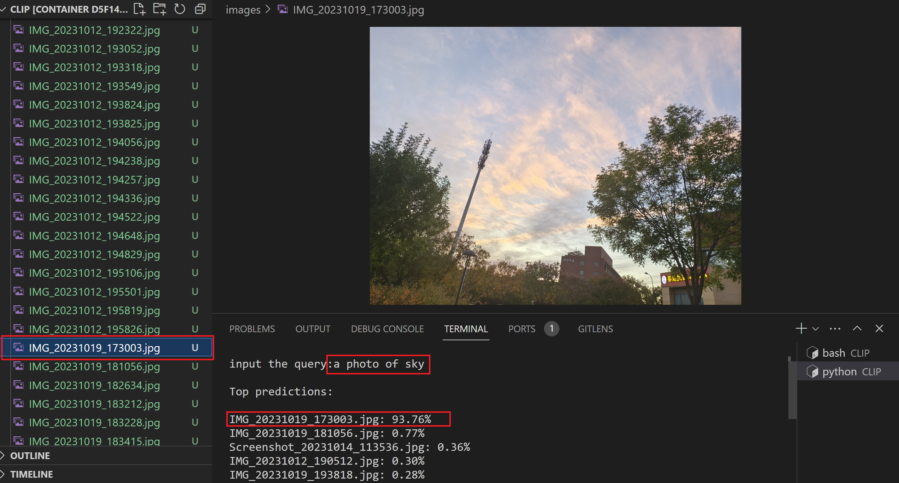
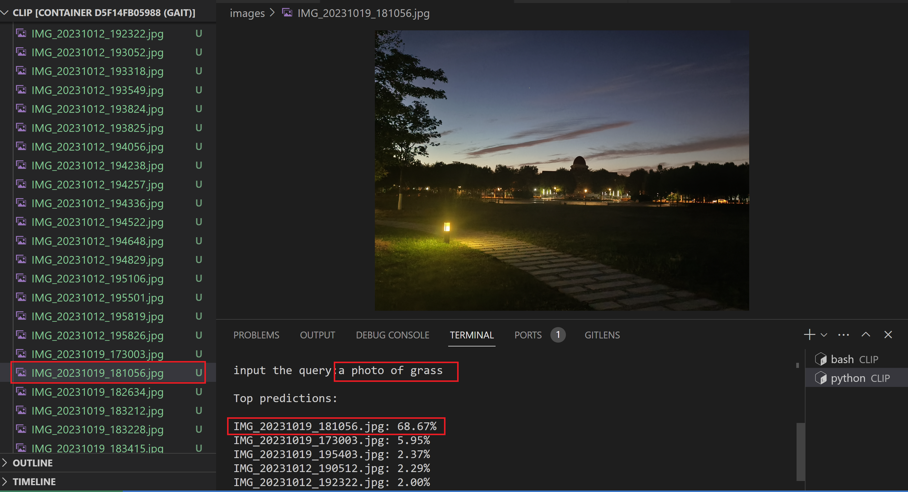
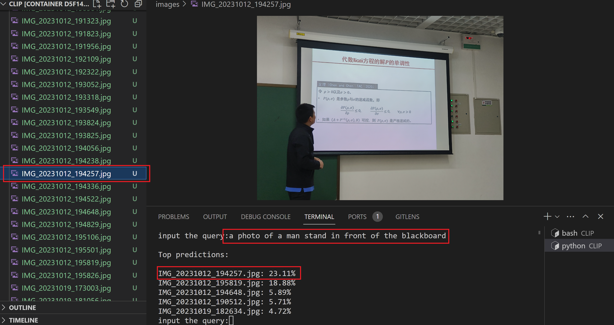

# CLIP
HW of Computer Vision, AI school, NKU
## Install
Follow the install in [openai CLIP](https://github.com/openai/CLIP)
## Usage
0. clone the repo.
```
git clone https://github.com/simplaj/CLIP.git
cd CLIP
```
1. creat a dir to put your image wanted to be searched
```
mkdir images
```
2. run the script
```
python main.py
```
3. input your query(attetion it should be expressed in english)
```
input the query:
```
### Example
#### a photo of sky

#### a photo of grass

#### a photo of a man stand in front of the blackborad
